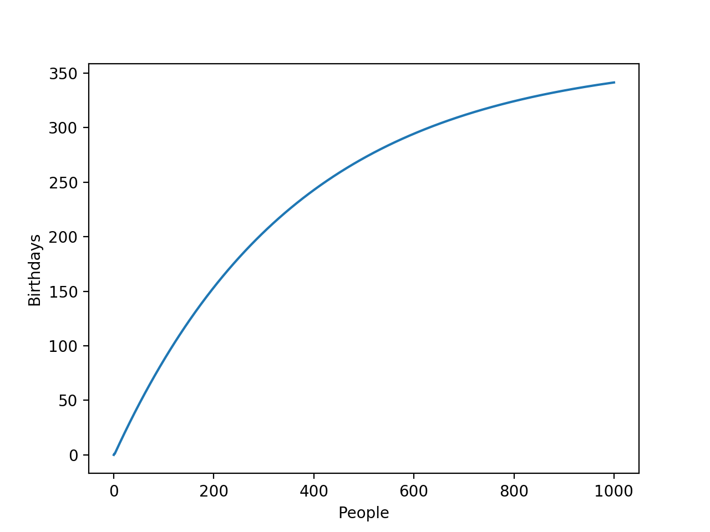
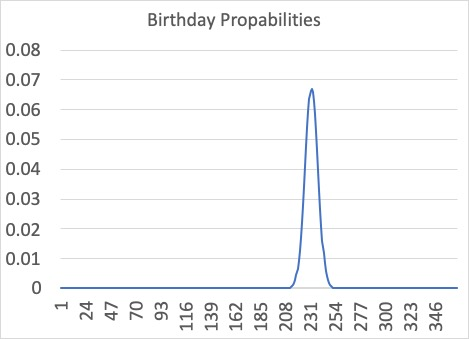

# Problem
There are M members in a group. The birthday of a member is uniformly random in a year. The group celebrates if there is at least one member who is on birthday at a day. Then, how many days in average does the group celebrate in a year? 

# Analytical Solution
For any given day in a year, the probability that it's not the birthday of the first person is `p(1)=364/365`. 
Given that the probability that this day is not the birthday of the second person is indipendent from the probability of the first person. The chance it's not a birthday in a group of two is `p(2) = p(1)^2`. 
Therefore, in a group of `M` people, the chance it's not a birthday is 
```
p(M) = p(1)^M = (364/365)^M
```
There are 365 such days in a year. So in average, there are `365*(364/365)^M` non-birthdays in a group of M people. 

The following is the plot of average birthdays in a year against number of members



# Numerical Solution
## Probability analysis
The average day can be calculated by 
```
\sum_{k=1}^{N} k p(k)
```
where `N` is the number of days in a year, `p(k)` is the probability that `k` exact days are birthdays in a year. 

Probability is calculated by the permutation when there are `k` exact days, divided by the all posibilities when M members random choose among N days. 
```
p(k) = permutation / (N**M)
```

## Dynamic programming
The problem is solved using dynamic programming. Let `f(n,k)` denotes the permutation when there are M member in the group, n days in a year, and exact k days are birthdays. Let `bi(a,b)` denotes the binominal coefficient choosing b in a.
```
f(1,1)=bi(1,1)*(1**M)
f(2,1)=bi(2,1)*f(1,1), f(2,2)=(2**M)-f(2,1)
f(3,1)=bi(3,1)*f(1,1), f(3,2)=bi(3,2)*f(2,2), f(3,3)=(2**M)-f(3,1)-f(3,2)
f(n,k)=bi(n,k)*f(k,k) if k<n
```
# Examples
## Example 1
When there are 365 members in a group, and 365 days in a year, the `average_birthdays(365,365)` returns `230.91`. 

The probabilities of k birthdays are distributed like



## Example 2
When there are 500 members in a group, and 365 days in a year, the average number of birthdays is `272.41`.

## Example 3
When there are 1000 members in the group, the probabilities when there are 365 birthdays is as low as `1.7123209e-12`
